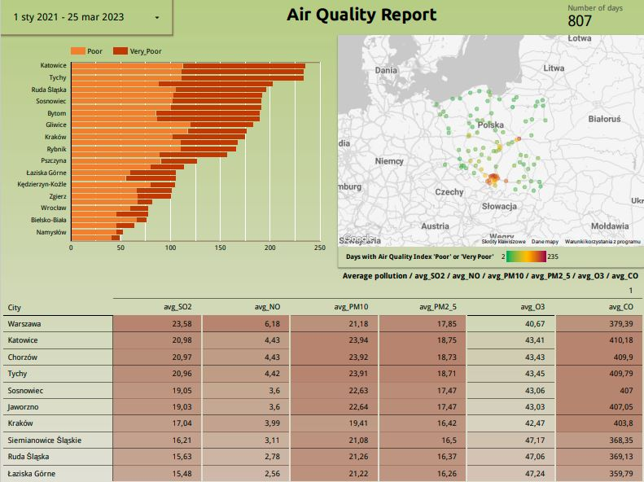

# Air Pollution Hourly Data Pipeline

## Objective

This data engineering project focuses on analyzing air quality data for 100 Polish cities. The data was obtained from the Weather API (https://openweathermap.org/api), which provides current, forecast, and historical air pollution data for any coordinates on the globe. The API returns data about polluting gases such as CO, NO, NO2, O3, SO2, NH3, and particulates PM2.5 and PM10.

## Architecture


## Problem statement

The goal of this project is to determine the most polluted cities based on their Air Quality Index (AQI) levels, which have different qualitative names and correspond to different ranges of pollutant concentrations in μg/m3. The analysis is performed using historical data available from 27th November 2020 to analyze air quality trends in the cities over time.

| Qualitative name | Index | SO2 (μg/m3) | NO2 (μg/m3) | PM10 (μg/m3) | PM2.5 (μg/m3) | O3 (μg/m3) | CO (μg/m3) |
|------------------|-------|-------------|-------------|---------------|----------------|------------|-------------|
| Good             | 1     | 0-20        | 0-40        | 0-20          | 0-10           | 0-60      | 0-4400    |
| Fair             | 2     | 20-80       | 40-70       | 20-50         | 10-25          | 60-100    | 4400-9400 |
| Moderate         | 3     | 80-250      | 70-150      | 50-100        | 25-50          | 100-140   | 9400-12400|
| Poor             | 4     | 250-350     | 150-200     | 100-200       | 50-75          | 140-180   | 12400-15400|
| Very Poor        | 5     | >350        | >200        | >200          | >75            | >180      | >15400    |


## Main objective

The following steps were performed to analyze the air quality data for the 100 Polish cities:

- Data Retrieval: Air quality data was retrieved from the Air Pollution API for the 100 Polish cities.
- AQI Calculation: The AQI levels were calculated for each city based on the pollutant concentrations in the data using the AQI formula provided in the API documentation.
- City Ranking: The cities were ranked based on their AQI levels, and the most polluted cities were identified.
- Visualization: The results were visualized using Google Looker Studio.


## Dataset description

Air Pollution API provides current, forecast and historical air pollution data for any coordinates on the globe.

The API returns data about polluting gases, such as Carbon monoxide (CO), Nitrogen monoxide (NO), Nitrogen dioxide (NO2), Ozone (O3), Sulphur dioxide (SO2), Ammonia (NH3), and particulates (PM2.5 and PM10).

The dataset has the following columns:

dt: The date and time when the measurements were taken.

Carbon_Monoxide_CO: The concentration of carbon monoxide in parts per million (ppm) at the time of measurement.

Nitric_oxide_NO: The concentration of nitric oxide in parts per billion (ppb) at the time of measurement.

Nitrogen_Dioxide_NO2: The concentration of nitrogen dioxide in parts per billion (ppb) at the time of measurement.

Ozone_O3: The concentration of ozone in parts per million (ppm) at the time of measurement.

Sulfur_Dioxide_SO2: The concentration of sulfur dioxide in parts per billion (ppb) at the time of measurement.

PM2_5: The concentration of fine particulate matter with diameter less than 2.5 micrometers in micrograms per cubic meter (µg/m³) at the time of measurement.

PM10: The concentration of coarse particulate matter with diameter less than 10 micrometers in micrograms per cubic meter (µg/m³) at the time of measurement.

NH3: The concentration of ammonia in parts per billion (ppb) at the time of measurement.

City_index: An integer index representing the city where the measurements were taken.

## Proposal

### Technologies
## What technologies are being used?
- Cloud: [Google Cloud](https://cloud.google.com)
- Infrastructure: [Terraform](https://www.terraform.io/)
- Orchestration: [Prefect](https://www.prefect.io/)
- Data lake: [Google Cloud Storage](https://cloud.google.com/storage)
- Data transformation: [DBT](https://www.getdbt.com/)
- Data warehouse: [BigQuery](https://cloud.google.com/bigquery)
- Data visualization: [Google Looker Studio](https://cloud.google.com/looker)


### Repository organization
- \blocks: python files to create prefect blocks. 
- \data: python script to get coordinates of cities (cities_coordinates.py, locations.json). 
- \dbt: dbt files (dbt_project.yml, models, etc.).
- \flow: prefect flows files (etl_tasks.py, history_parameterized_flow.py, current_parameterized_flow.py, docker_deployment.py).  
- \images: pictures.  
- \terraform: terraform files for the definition of the infrastructure to deploy.  
- \README.md: this document.  
- \setup_gcp.md: instructions to configure cgp account.  
- \setup_vm.md: instructions to setup the VM in GCP.  

**Infrastructure as code:**  

Use Terraform to create a bucket GCS and dataset in BQ  
- airpollution bucket to store parquet files.
- raw dataset for the ingestion into BigQuery.
- development dataset for dbt cloud development environment.
- production dataset for dbt cloud production environment. 

  **Orchestration:**  
To use Prefect to retrieve data from the Weather API (https://openweathermap.org/api) and load it into CGS before finally inserting it into a regular BigQuery table, follow the steps below:
- Create a free account on https://home.openweathermap.org/users/sign_up and generate your API key.
- Export your API key in the following format:
```bash
export API_KEY=<insert your key here>
```
This key will be used by the script to authenticate your requests to the Weather API.
- Sign-up for the prefect cloud and create a workspace [here](https://app.prefect.cloud/auth/login)
- Create the [prefect blocks](https://docs.prefect.io/concepts/blocks/) via the cloud UI or adjust the variables in `/blocks/make_gcp_blocks.py` and `/blocks/make_docker_block.py` then run
```bash
python blocks/make_gcp_blocks.py
python blocks/make_docker_block.py
```
- To execute the flow, run the following commands in two different CL terminals
```bash
prefect agent start -q 'default'
```
```bash
python flows/history_parameterized_flow.py
```

**Transformations using dbt:**  
  
  Use dbt cloud to perform joins and aggregations on BQ.  
  - Staging (materialized=view):  
    - airpollution and cities: Create staged model from airpollution and cities tables in Big Query.  
    - The output will be `stg_air_pollution` and `stg_cities` models.  
       
  - Core (materialized=table):
    - `fact_pollution` materialized model by joining `stg_air_pollution` with `stg_cities` models. 
    - In addition, a `agg_pollution_by_day` model has been created. This model averages the daily observations and determines daily pollution quality for every city. 
  - Job:
    - For the convenient creation of the production dataset, a job `dbt build` will be created.
    - This job can be run manually (or scheduled) from dbt cloud.

    **Dashboard:**  
  
  Connect Google Data Studio to BQ dataset and design dashboard  

  ## Results

**Dashboard**

<p align="left">

</p>

You can check my dashboard here:
https://lookerstudio.google.com/reporting/34c9db2f-e5e6-4fae-9a89-c89c0f134c3e

## Setup and running

Terraform and Prefect will run in a VM in Google Cloud. Prefect will run as docker container (It is possible to just install requirements in conda environment for example).
For data transformation:  
Dbt cloud will be used to perform data transformation pipeline.  
  
Your gcp account will be used and, unless you have google's welcome credit, it will have some cost.
Your dbt cloud account will be used. Developer account is free.

If you wish to install the required tools in your own machine instead of in the VM, the instructions in `setup_gcp.md` will be a good starting point.

### Setup

Note: This setup is not mean to be for production environment. More specific service account roles should be implemented as well as changing default passwords (e.g. `sudo passwd` in your VM to create the root password since VMs in GCE does not provide a password for root user).

Follow the following steps in the same order:
1. Google Cloud Platform account and project:  
  Follow the instructions in `setup_gcp.md`  
2. Virtual Machine in Google Cloud Compute Engine:  
  Follow the instructions in `setup_vm.md`

### Run pipelines
1. Setup your Google Cloud environment
- Create a [Google Cloud Platform project](https://console.cloud.google.com/cloud-resource-manager)
- Configure Identity and Access Management (IAM) for the service account, giving it the following privileges: BigQuery Admin, Storage Admin and Storage Object Admin
- Download the JSON credentials and save it, e.g. to `~/.gc/<credentials>`
- Install the [Google Cloud SDK](https://cloud.google.com/sdk/docs/install-sdk)
- Let the [environment variable point to your GCP key](https://cloud.google.com/docs/authentication/application-default-credentials#GAC), authenticate it and refresh the session token
```bash
export GOOGLE_APPLICATION_CREDENTIALS=<path_to_your_credentials>.json
gcloud auth activate-service-account --key-file $GOOGLE_APPLICATION_CREDENTIALS
gcloud auth application-default login
```
2. Install all required dependencies into your environment
```bash
pip install -r requirements.txt
```
3. Terraform
`cd terraform`
`terraform init`
`terraform plan -var="project=<your-gcp-project-id>"`
`terraform apply -var="project=<your-gcp-project-id>"`

4. API_KEY
- Export your API key in the following format:
```bash
export API_KEY=<insert your key here>
```

5. Setup your orchestration

- Create the [prefect blocks](https://docs.prefect.io/concepts/blocks/) via the cloud UI or adjust the variables in `/blocks/make_gcp_blocks.py` and `/blocks/make_docker_block.py` then run
```bash
python blocks/make_gcp_blocks.py
python blocks/make_docker_block.py
```
- To execute the flow, run the following commands in two different CL terminals
```bash
prefect agent start -q 'default'
```
```bash
python flows/history_parameterized_flow.py
```
